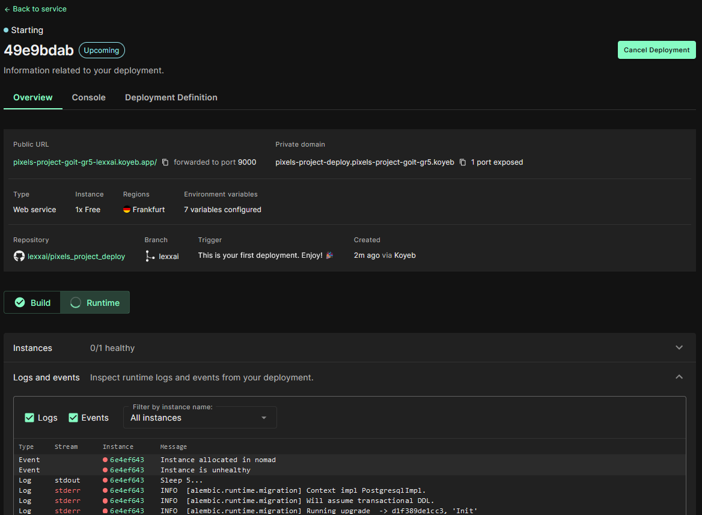
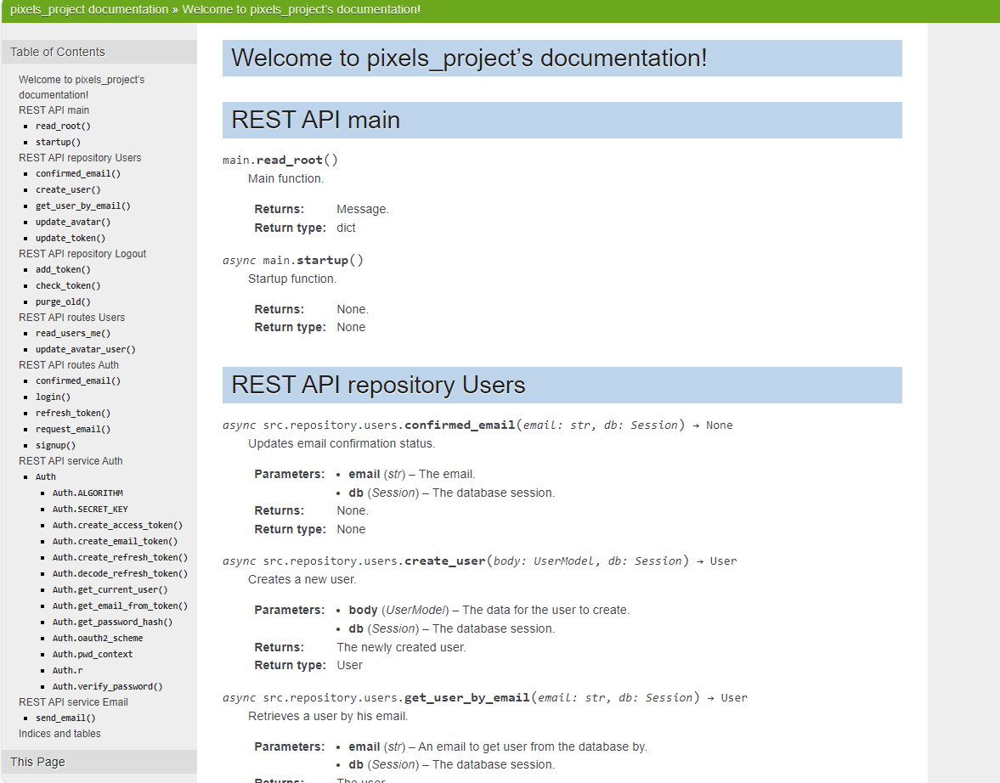

# pixels_project

# Технічне завдання на створення застосунку “PhotoShare” (REST API)

## Основний функціонал для REST API виконаний на FastAPI

### Аутентифікація
### Робота с світлинами
### Коментування
### Додатковий функціонал
### Додатково по можливості реалізувати наступні задачі, якщо дозволяє час.


# Виконнаня

## FastAPI docs

http://localhost:9000/docs


## DEPLOY

### DOCKER COMPOSE PROJECT PIXELS

#### DOCKER BUILD

`docker-compose  --file docker-compose-project.yml --env-file .env_prod build`

```
2023/12/08 22:49:34 http2: server: error reading preface from client //./pipe/docker_engine: file has already been closed
[+] Building 93.9s (14/14) FINISHED                                                                                                      docker:default 
 => [code internal] load build definition from Dockerfile                                                                                          0.0s
 => => transferring dockerfile: 1.17kB                                                                                                             0.0s 
 => [code internal] load .dockerignore                                                                                                             0.0s 
 => => transferring context: 2B                                                                                                                    0.0s 
 => [code internal] load metadata for docker.io/library/python:3.11                                                                                2.2s 
 => [code auth] library/python:pull token for registry-1.docker.io                                                                                 0.0s
 => [code 1/8] FROM docker.io/library/python:3.11@sha256:0698431f4610b4cad4ccea2b3e2754dfbb61ac4c553bbd2b044d716a917f2cdc                          0.0s
 => [code internal] load build context                                                                                                             4.4s 
 => => transferring context: 49.90MB                                                                                                               4.3s
 => CACHED [code 2/8] WORKDIR /app                                                                                                                 0.0s
 => [code 3/8] COPY . .                                                                                                                            1.1s 
 => [code 4/8] COPY run.sh run.sh                                                                                                                  0.1s
 => [code 5/8] COPY src/ src/                                                                                                                      0.1s 
 => [code 6/8] COPY main.py main.py                                                                                                                0.1s
 => [code 7/8] COPY requirements.txt requirements.txt                                                                                              0.1s 
 => [code 8/8] RUN pip install -r requirements.txt                                                                                                84.3s 
 => [code] exporting to image                                                                                                                      1.3s 
 => => exporting layers                                                                                                                            1.3s 
 => => writing image sha256:3be444c0e7e6e2131beb8716bc56e072a303b805e08294d247a4e824e764e1e3                                                       0.0s 
 => => naming to docker.io/library/pixels-code                                                                                                     0.0s 

```
#### DOCKER RUN

`docker-compose  --file docker-compose-project.yml --env-file .env_prod up`

```
[+] Building 0.0s (0/0)                                                                                                                  docker:default
[+] Running 3/3
 ✔ Network pixels_default   Created                                                                                                                0.1s 
 ✔ Container pixels-pg-1    Created                                                                                                                1.4s 
 ✔ Container pixels-code-1  Created                                                                                                                0.3s 
Attaching to pixels-code-1, pixels-pg-1
pixels-code-1  | Sleep 5...
pixels-pg-1    | 
pixels-pg-1    | PostgreSQL Database directory appears to contain a database; Skipping initialization
pixels-pg-1    |
pixels-pg-1    | 2023-12-08 20:51:20.140 UTC [1] LOG:  starting PostgreSQL 12.17 (Debian 12.17-1.pgdg120+1) on x86_64-pc-linux-gnu, compiled by gcc (Debian 12.2.0-14) 12.2.0, 64-bit
pixels-pg-1    | 2023-12-08 20:51:20.140 UTC [1] LOG:  listening on IPv4 address "0.0.0.0", port 5432
pixels-pg-1    | 2023-12-08 20:51:20.140 UTC [1] LOG:  listening on IPv6 address "::", port 5432
pixels-pg-1    | 2023-12-08 20:51:20.182 UTC [1] LOG:  listening on Unix socket "/var/run/postgresql/.s.PGSQL.5432"
pixels-pg-1    | 2023-12-08 20:51:20.374 UTC [28] LOG:  database system was shut down at 2023-12-08 20:49:14 UTC
pixels-pg-1    | 2023-12-08 20:51:20.478 UTC [1] LOG:  database system is ready to accept connections
pixels-code-1  | INFO  [alembic.runtime.migration] Context impl PostgresqlImpl.
pixels-code-1  | INFO  [alembic.runtime.migration] Will assume transactional DDL.
pixels-code-1  | INFO  [alembic.runtime.migration] Running upgrade  -> d1f389de1cc3, 'Init'

```

### DEPLOY TO koyeb.com

#### Config env


#### Build


#### Run



## TEST

### UNIT TEST REPOSITORY
#### LOGOUT
`python.exe "tests\test_unit_repository_logout.py"`
```
.......
----------------------------------------------------------------------
Ran 7 tests in 0.365s

OK
```

`pytest tests -v`
```
========================================================== test session starts ===========================================================
platform win32 -- Python 3.11.6, pytest-7.4.3, pluggy-1.3.0 -- 
plugins: anyio-3.7.1
collected 7 items

tests/test_unit_repository_logout.py::TestContactsRepository::test_add_token PASSED                                                 [ 14%]
tests/test_unit_repository_logout.py::TestContactsRepository::test_add_token_wrong_empty PASSED                                     [ 28%] 
tests/test_unit_repository_logout.py::TestContactsRepository::test_add_token_wrong_none PASSED                                      [ 42%]
tests/test_unit_repository_logout.py::TestContactsRepository::test_check_token_is PASSED                                            [ 57%]
tests/test_unit_repository_logout.py::TestContactsRepository::test_check_token_missed PASSED                                        [ 71%]
tests/test_unit_repository_logout.py::TestContactsRepository::test_purge_token PASSED                                               [ 85%]
tests/test_unit_repository_logout.py::TestContactsRepository::test_purge_token_empty PASSED                                         [100%]

=========================================================== 7 passed in 1.36s ============================================================ 
```


## DOCS SPHINX

```
sphinx-quickstart docs
cd docs
.\make.bat html
```

```
Running Sphinx v7.2.6
loading pickled environment... done
building [mo]: targets for 0 po files that are out of date
writing output... 
building [html]: targets for 1 source files that are out of date
updating environment: 0 added, 1 changed, 0 removed
reading sources... [100%] index
looking for now-outdated files... none found
pickling environment... done
checking consistency... done
preparing documents... done
copying assets... copying static files... done
copying extra files... done
done
writing output... [100%] index
generating indices... genindex py-modindex done
writing additional pages... search done
dumping search index in English (code: en)... done
dumping object inventory... done
build succeeded.

The HTML pages are in _build\html.

```
