# pixels_project

# Технічне завдання на створення застосунку “PhotoShare” (REST API)

## Основний функціонал для REST API виконаний на FastAPI

### Аутентифікація
- Механізм аутентифікації. JWT токени.
- Користувачі мають три ролі. Звичайний користувач, модератор, та адміністратор. Перший користувач в системі завжди адміністратор
- Для реалізації різних рівнів доступу (звичайний користувач, модератор і адміністратор) використовуються декоратори FastAPI для перевірки токена і ролі користувача. 

### Робота з світлинами
- Користувачі можуть завантажувати світлини з описом (POST).
- Користувачі можуть видаляти світлини (DELETE).
- Користувачі можуть редагувати опис світлини (PUT).
- Користувачі можуть отримувати світлину за унікальним посиланням (GET).
- Можливість додавати до 5 тегів під світлину. Додавання тегу не обов'язкове при завантаженні світлини.
- Теги унікальні для всього застосунку. Тег передається на сервер по імені. Якщо такого тега не існує, то він створюється, якщо існує, то для світлини береться тег що існує з такою назвою.
- Користувачі можуть виконувати базові операції над світлинами, які дозволяє сервіс Cloudinary (https://cloudinary.com/documentation/image_transformations). Можливо вибрати обмежений набір трансформацій над світлинами для свого застосунку з Cloudinary.
- Користувачі можуть створювати посилання на трансформоване зображення для перегляду світлини в вигляді URL та QR-code (https://pypi.org/project/qrcode/). Операція POST, оскільки створюється окреме посилання на трансформоване зображення, яке зберігається в базі даних
- Створені посилання зберігаються на сервері і через мобільний телефон ми можемо відсканувати QR-code та побачити зображення
- Адміністратори можуть робить всі CRUD операції зі світлинами користувачів


### Коментування
- Під кожною світлиною, є блок з коментарями. Користувачі можуть коментувати світлину один одного
- Користувач може редагувати свій коментар, але не видаляти
- Адміністратори та модератори можуть видаляти коментарі.
- Для коментарів обов'язково зберігати час створення та час редагування коментаря в базі даних. Для реалізації функціональності коментарів, ми можемо використовувати відношення "один до багатьох" між світлинами і коментарями в базі даних. Для тимчасового маркування коментарів, використовувати стовпці "created_at" і "updated_at" у таблиці коментарів.

### Додатковий функціонал
- Створити маршрут для профіля користувача за його унікальним юзернеймом. Повинна повертатися вся інформація про користувача. Імя, коли зареєстрований, кількість завантажених фото тощо
- Користувач може редагувати інформацію про себе, та бачити інформацію про себе. Це мають бути різні маршрути з профілем користувача. Профіль для всіх користувачів, а інформація для себе - це те що можна редагувати
- Адміністратор може робити користувачів неактивними (банити). Неактивні користувачі не можуть заходити в застосунок


### Додатково по можливості реалізувати наступні задачі, якщо дозволяє час.
- Реалізувати механізм виходу користувача з застосунку через logout. Access token повинен бути добавлений на час його існування в чорний список.

- Рейтинг
  - Користувачі можуть виставляти рейтинг світлині від 1 до 5 зірок. Рейтинг обчислюється як середнє значення оцінок всіх користувачів. 
  - Можна тільки раз виставляти оцінку світлині для користувача. 
  - Не можливо оцінювати свої світлини. 
  - Модератори та адміністратори можуть переглядати та видаляти оцінки користувачів.

- Пошук та фільтрація
  - Користувач може здійснювати пошук світлин за ключовим словом або тегом. Після пошуку користувач може відфільтрувати результати за рейтингом або датою додавання.
  - Модератори та адміністратори можуть виконувати пошук та фільтрацію за користувачами, які додали світлини.


# Виконання

## Спільна робота

### Організаційні процеси
#### Склад команди розробників
1. [Team Lead](https://github.com/SVcheburator) @ SVcheburator 
1. [Scrum Master](https://github.com/AlexanderBgit) @AlexanderBgit
1. [Developer](https://github.com/OleksiiHladkov) @OleksiiHladkov
1. [Developer](https://github.com/lexxai) @lexxai 

#### Trello Розподілення задач мід розробниками
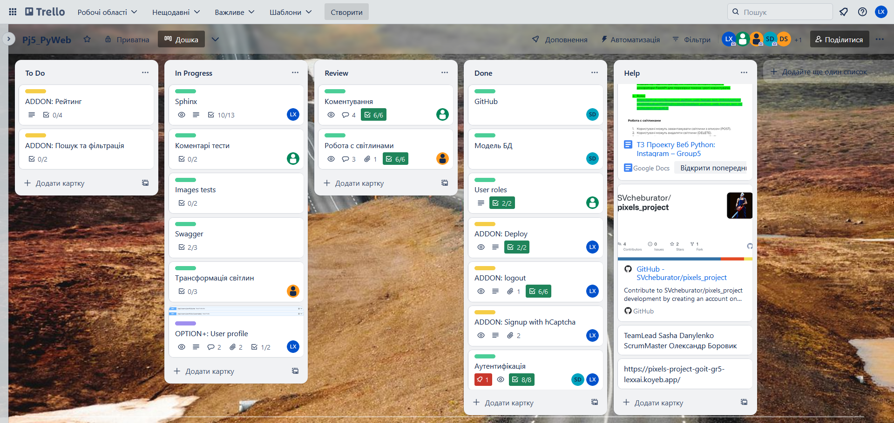

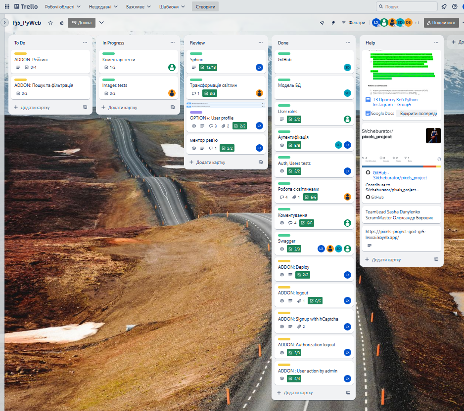

### Спільний робочий простір розробки Git
#### Розподілення git brach між розробниками
- Основна гілка розробки - built
- main - фінальна для релізів
- кожному розробнику створена власна гілка, котру розробник синхронізує з built

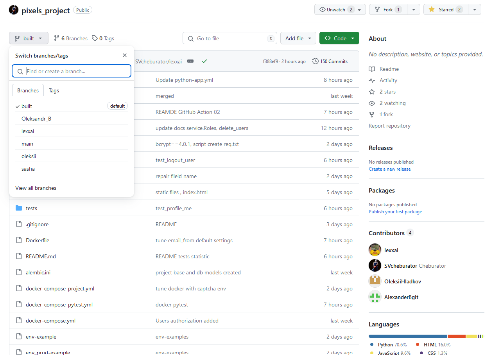

#### Захист git branch 
-  main - merge only owner
-  build - merge require approval by 1 developer

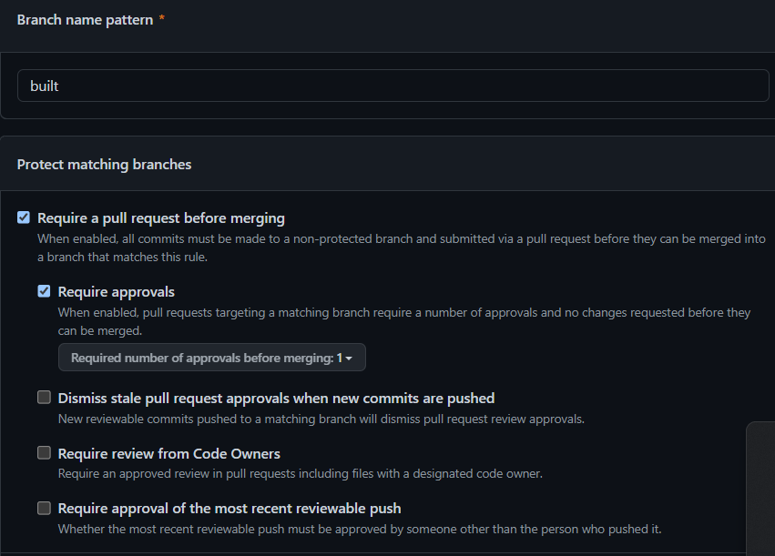

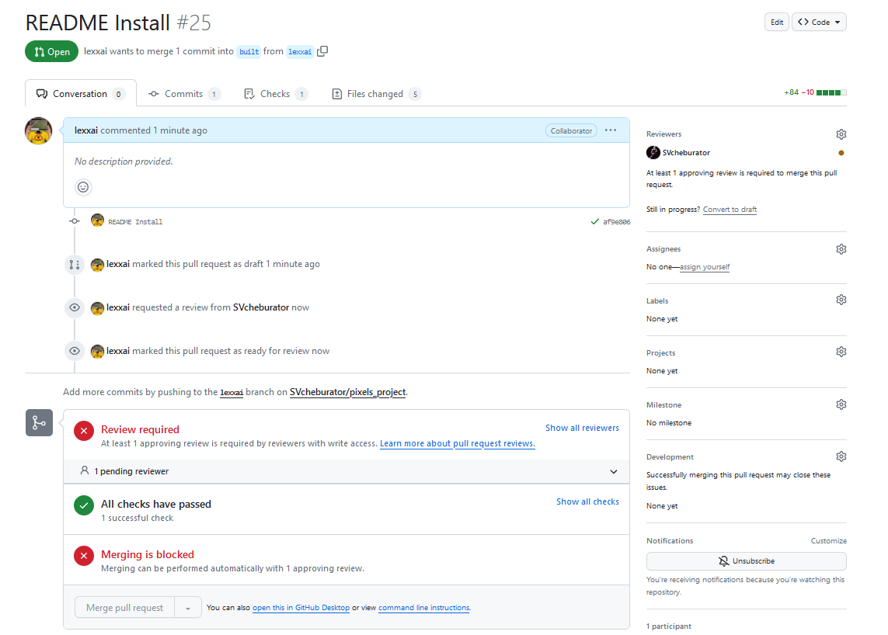

#### Перевірка перед merge - Git Action - Python Build (СI)  (pytest)


## Розділи завдань

## Встановлення

### Завантаження проєкту
```
git clone https://github.com/SVcheburator/pixels_project
cd ./pixels_project
git checkout *developer_branch*
```
### Створення змінних оточення для проєкту
- На овнові `env-example` створюємо новий файл `.env`
- На овнові `env_prod-example` створюємо новий файл `.env_prod`


### Docker
```
docker-compose  --file docker-compose-project.yml --env-file .env_prod  up -d 

[+] Building 0.0s (0/0)                                                                       docker:default
[+] Running 3/3
 ✔ Container pixels-redis-1  Started                                                                   0.0s 
 ✔ Container pixels-pg-1     Started                                                                   0.0s 
 ✔ Container pixels-code-1   Started                                                                   0.0s
```

### Середовище розробника

##### Віртуальне оточення проєкту
- venv
```
python -m venv venv
./venv/Script/activate
pip install -r requirements.txt
```
- poetry
```
poetry init
poetry shell
poetry update
```
##### Запуск проєкту
```
python ./main.py
                   
INFO:     Will watch for changes in these directories: ['...\\Project_group_5\\pixels_project']
INFO:     Uvicorn running on http://0.0.0.0:9000 (Press CTRL+C to quit)
INFO:     Started reloader process [19228] using WatchFiles
INFO:     Started server process [18616]
INFO:     Waiting for application startup.
INFO:     Application startup complete.
```
##### Підключення до проєкту

Відкрити браузер за посиланням http://localhost:9000 

## Розділи FastAPI реалізації 
FastAPI docs (Swagger) - http://localhost:9000/docs
### Аутентифікація


### Користувачі


##### Користувачі підтвердження Email 


### Робота з світлинами


### Коментування


### Додатковий функціонал


## Тестування. Простий Front end. STATIC HTML / JavaScript Auth client.


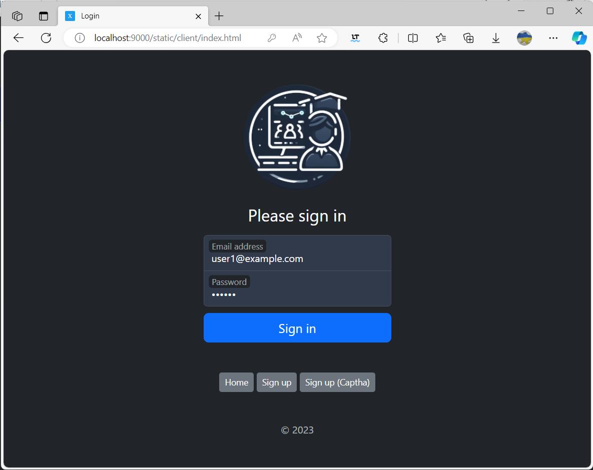

JavaScript Client with automatic token update.
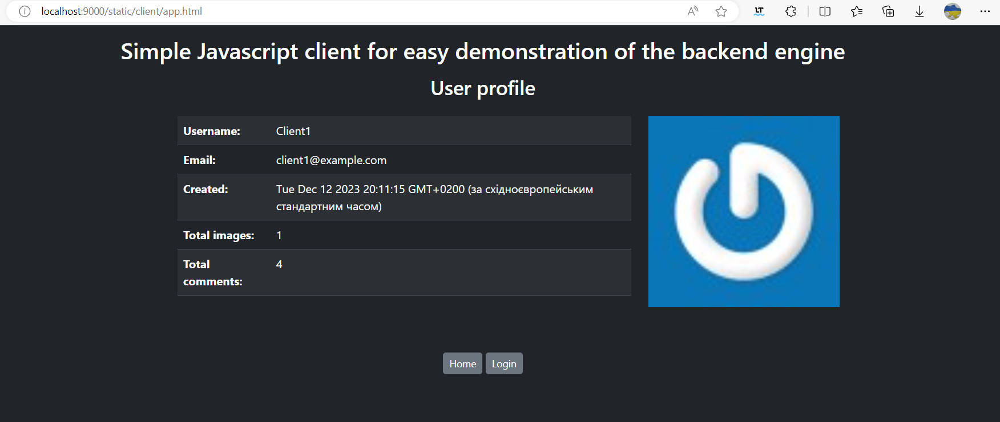


## DEPLOY

### DOCKER COMPOSE PROJECT PIXELS

#### DOCKER BUILD

`docker-compose  --file docker-compose-project.yml --env-file .env_prod build`

```
2023/12/08 22:49:34 http2: server: error reading preface from client //./pipe/docker_engine: file has already been closed
[+] Building 93.9s (14/14) FINISHED                                                                                                      docker:default 
 => [code internal] load build definition from Dockerfile                                                                                          0.0s
 => => transferring dockerfile: 1.17kB                                                                                                             0.0s 
 => [code internal] load .dockerignore                                                                                                             0.0s 
 => => transferring context: 2B                                                                                                                    0.0s 
 => [code internal] load metadata for docker.io/library/python:3.11                                                                                2.2s 
 => [code auth] library/python:pull token for registry-1.docker.io                                                                                 0.0s
 => [code 1/8] FROM docker.io/library/python:3.11@sha256:0698431f4610b4cad4ccea2b3e2754dfbb61ac4c553bbd2b044d716a917f2cdc                          0.0s
 => [code internal] load build context                                                                                                             4.4s 
 => => transferring context: 49.90MB                                                                                                               4.3s
 => CACHED [code 2/8] WORKDIR /app                                                                                                                 0.0s
 => [code 3/8] COPY . .                                                                                                                            1.1s 
 => [code 4/8] COPY run.sh run.sh                                                                                                                  0.1s
 => [code 5/8] COPY src/ src/                                                                                                                      0.1s 
 => [code 6/8] COPY main.py main.py                                                                                                                0.1s
 => [code 7/8] COPY requirements.txt requirements.txt                                                                                              0.1s 
 => [code 8/8] RUN pip install -r requirements.txt                                                                                                84.3s 
 => [code] exporting to image                                                                                                                      1.3s 
 => => exporting layers                                                                                                                            1.3s 
 => => writing image sha256:3be444c0e7e6e2131beb8716bc56e072a303b805e08294d247a4e824e764e1e3                                                       0.0s 
 => => naming to docker.io/library/pixels-code                                                                                                     0.0s 

```
#### DOCKER RUN

`docker-compose  --file docker-compose-project.yml --env-file .env_prod up`

```
[+] Building 0.0s (0/0)                                                                                    docker:default
[+] Running 3/3
 ✔ Container pixels-pg-1     Created                                                                                 0.0s 
 ✔ Container pixels-redis-1  Created                                                                                 0.0s 
 ✔ Container pixels-code-1   Recreated                                                                               0.8s 
Attaching to pixels-code-1, pixels-pg-1, pixels-redis-1
pixels-redis-1  | 1:C 12 Dec 2023 18:34:26.534 # WARNING Memory overcommit must be enabled! Without it, a background save or replication may fail under low memory condition. Being disabled, it can also cause failures without low memory condition, see https://github.com/jemalloc/jemalloc/issues/1328. To fix this issue add 'vm.overcommit_memory = 1' to /etc/sysctl.conf and then reboot or run the command 'sysctl vm.overcommit_memory=1' for this to take effect.
pixels-redis-1  | 1:C 12 Dec 2023 18:34:26.535 * oO0OoO0OoO0Oo Redis is starting oO0OoO0OoO0Oo
pixels-redis-1  | 1:C 12 Dec 2023 18:34:26.535 * Redis version=7.2.3, bits=64, commit=00000000, modified=0, pid=1, just started
pixels-redis-1  | 1:C 12 Dec 2023 18:34:26.535 # Warning: no config file specified, using the default config. In order to specify a config file use redis-server /path/to/redis.conf
pixels-redis-1  | 1:M 12 Dec 2023 18:34:26.536 * monotonic clock: POSIX clock_gettime
pixels-redis-1  | 1:M 12 Dec 2023 18:34:26.536 * Running mode=standalone, port=6379.
pixels-redis-1  | 1:M 12 Dec 2023 18:34:26.560 * Server initialized
pixels-redis-1  | 1:M 12 Dec 2023 18:34:26.561 * Loading RDB produced by version 7.2.3
pixels-redis-1  | 1:M 12 Dec 2023 18:34:26.561 * RDB age 8 seconds
pixels-redis-1  | 1:M 12 Dec 2023 18:34:26.561 * RDB memory usage when created 0.83 Mb
pixels-redis-1  | 1:M 12 Dec 2023 18:34:26.561 * Done loading RDB, keys loaded: 0, keys expired: 0.
pixels-redis-1  | 1:M 12 Dec 2023 18:34:26.561 * DB loaded from disk: 0.000 seconds
pixels-redis-1  | 1:M 12 Dec 2023 18:34:26.561 * Ready to accept connections tcp
pixels-code-1   | Sleep 5...
pixels-pg-1     | 
pixels-pg-1     | PostgreSQL Database directory appears to contain a database; Skipping initialization
pixels-pg-1     |
pixels-pg-1     | 2023-12-12 18:34:31.299 UTC [1] LOG:  starting PostgreSQL 12.17 (Debian 12.17-1.pgdg120+1) on x86_64-pc-linux-gnu, compiled by gcc (Debian 12.2.0-14) 12.2.0, 64-bit
pixels-pg-1     | 2023-12-12 18:34:31.300 UTC [1] LOG:  listening on IPv4 address "0.0.0.0", port 5432
pixels-pg-1     | 2023-12-12 18:34:31.301 UTC [1] LOG:  listening on IPv6 address "::", port 5432
pixels-pg-1     | 2023-12-12 18:34:31.486 UTC [1] LOG:  listening on Unix socket "/var/run/postgresql/.s.PGSQL.5432"
pixels-pg-1     | 2023-12-12 18:34:31.714 UTC [27] LOG:  database system was shut down at 2023-12-12 18:34:18 UTC
pixels-pg-1     | 2023-12-12 18:34:31.867 UTC [1] LOG:  database system is ready to accept connections
pixels-code-1   | INFO  [alembic.runtime.migration] Context impl PostgresqlImpl.
pixels-code-1   | INFO  [alembic.runtime.migration] Will assume transactional DDL.
pixels-code-1   | INFO  [alembic.runtime.migration] Running upgrade  -> d1f389de1cc3, 'Init'
pixels-code-1   | INFO  [alembic.runtime.migration] Running upgrade d1f389de1cc3 -> 16cee3a17066, BanList
pixels-code-1   | INFO:     Started server process [9]
pixels-code-1   | INFO:     Waiting for application startup.
pixels-code-1   | INFO:     Application startup complete.
pixels-code-1   | INFO:     Uvicorn running on http://0.0.0.0:9000 (Press CTRL+C to quit)
pixels-code-1   | INFO:     127.0.0.1:35428 - "GET /api/healthchecker HTTP/1.1" 200 OK
pixels-code-1   | INFO:     127.0.0.1:35586 - "GET /api/healthchecker HTTP/1.1" 200 OK
pixels-code-1   | INFO:     127.0.0.1:34896 - "GET /api/healthchecker HTTP/1.1" 200 OK
pixels-code-1   | INFO:     172.30.0.1:58140 - "GET / HTTP/1.1" 200 OK
pixels-code-1   | INFO:     172.30.0.1:58140 - "GET /docs/ HTTP/1.1" 307 Temporary Redirect
pixels-code-1   | INFO:     172.30.0.1:58140 - "GET /docs HTTP/1.1" 200 OK
pixels-code-1   | INFO:     172.30.0.1:58140 - "GET /openapi.json HTTP/1.1" 200 OK
pixels-code-1   | INFO:     172.30.0.1:58140 - "GET /favicon.ico HTTP/1.1" 404 Not Found
pixels-code-1   | INFO:     172.30.0.1:58140 - "POST /api/auth/login HTTP/1.1" 401 Unauthorized
pixels-code-1   | INFO:     172.30.0.1:58140 - "GET /client/index.html?error=login HTTP/1.1" 200 OK
pixels-code-1   | INFO:     172.30.0.1:58140 - "GET / HTTP/1.1" 200 OK
pixels-code-1   | INFO:     127.0.0.1:58194 - "GET /api/healthchecker HTTP/1.1" 200 OK
pixels-code-1   | INFO:     172.30.0.1:58140 - "GET /docs/ HTTP/1.1" 307 Temporary Redirect
pixels-code-1   | INFO:     172.30.0.1:58140 - "GET /docs HTTP/1.1" 200 OK
pixels-code-1   | INFO:     172.30.0.1:58140 - "GET /openapi.json HTTP/1.1" 200 OK
pixels-code-1   | INFO:     127.0.0.1:53348 - "GET /api/healthchecker HTTP/1.1" 200 OK
pixels-code-1   | INFO:     127.0.0.1:34928 - "GET /api/healthchecker HTTP/1.1" 200 OK
pixels-code-1   | INFO:     127.0.0.1:60840 - "GET /api/healthchecker HTTP/1.1" 200 OK
pixels-code-1   | INFO:     127.0.0.1:55090 - "GET /api/healthchecker HTTP/1.1" 200 OK
pixels-code-1   | INFO:     127.0.0.1:35110 - "GET /api/healthchecker HTTP/1.1" 200 OK
pixels-code-1   | INFO:     127.0.0.1:41156 - "GET /api/healthchecker HTTP/1.1" 200 OK
Gracefully stopping... (press Ctrl+C again to force)
Aborting on container exit...
[+] Stopping 3/3
 ✔ Container pixels-code-1   Stopped                                                                                10.8s     
 ✔ Container pixels-redis-1  Stopped                                                                                 1.1s     
 ✔ Container pixels-pg-1     Stopped                                                                                 2.4s     
canceled
```

### DEPLOY TO koyeb.com

#### Config env


#### Build
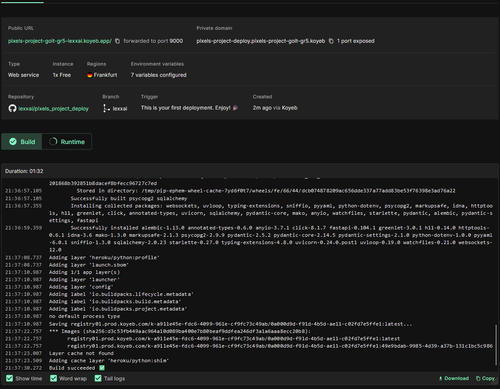


#### Run


#### GitHub automatic deploy to Koyeb.com
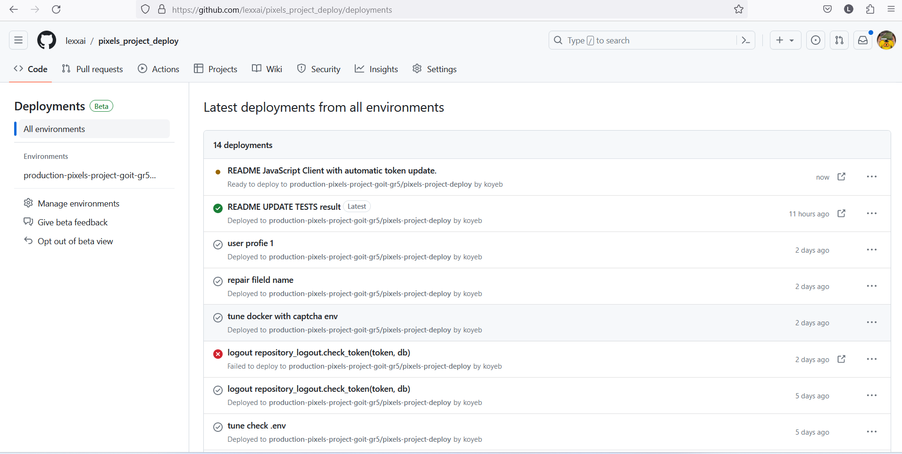
Result of deploy : https://pixels-project-goit-gr5-lexxai.koyeb.app/


## TEST

### UNIT TEST REPOSITORY
#### LOGOUT
`python.exe "tests\test_unit_repository_logout.py"`
```
.......
----------------------------------------------------------------------
Ran 7 tests in 0.365s

OK
```

`pytest tests -v`
```
========================================================== test session starts ===========================================================
platform win32 -- Python 3.11.6, pytest-7.4.3, pluggy-1.3.0 -- 
plugins: anyio-3.7.1
collected 7 items

tests/test_unit_repository_logout.py::TestContactsRepository::test_add_token PASSED                                                 [ 14%]
tests/test_unit_repository_logout.py::TestContactsRepository::test_add_token_wrong_empty PASSED                                     [ 28%] 
tests/test_unit_repository_logout.py::TestContactsRepository::test_add_token_wrong_none PASSED                                      [ 42%]
tests/test_unit_repository_logout.py::TestContactsRepository::test_check_token_is PASSED                                            [ 57%]
tests/test_unit_repository_logout.py::TestContactsRepository::test_check_token_missed PASSED                                        [ 71%]
tests/test_unit_repository_logout.py::TestContactsRepository::test_purge_token PASSED                                               [ 85%]
tests/test_unit_repository_logout.py::TestContactsRepository::test_purge_token_empty PASSED                                         [100%]

=========================================================== 7 passed in 1.36s ============================================================ 
```


## DOCS SPHINX

```
sphinx-quickstart docs
cd docs
.\make.bat html
```

```
Running Sphinx v7.2.6
loading pickled environment... done
building [mo]: targets for 0 po files that are out of date
writing output... 
building [html]: targets for 1 source files that are out of date
updating environment: 0 added, 1 changed, 0 removed
reading sources... [100%] index
looking for now-outdated files... none found
pickling environment... done
checking consistency... done
preparing documents... done
copying assets... copying static files... done
copying extra files... done
done
writing output... [100%] index
generating indices... genindex py-modindex done
writing additional pages... search done
dumping search index in English (code: en)... done
dumping object inventory... done
build succeeded.

The HTML pages are in _build\html.

```


## PyTEST
pytest -v tests

```
===================================================== test session starts ==================================
platform win32 -- Python 3.11.6, pytest-7.4.3, pluggy-1.3.0 -- 
configfile: pyproject.toml
plugins: anyio-3.7.1, cov-4.1.0
collected 37 items

tests/test_pytest_route_users.py::test_create_admin_user PASSED                                        [  2%]
tests/test_pytest_route_users.py::test_repeat_create_same_user PASSED                                  [  5%] 
tests/test_pytest_route_users.py::test_create_general_user PASSED                                      [  8%]
tests/test_pytest_route_users.py::test_login_user_not_confirmed PASSED                                 [ 10%]
tests/test_pytest_route_users.py::test_login_user_not_active PASSED                                    [ 13%]
tests/test_pytest_route_users.py::test_login_user PASSED                                               [ 16%]
tests/test_pytest_route_users.py::test_login_wrong_password PASSED                                     [ 18%]
tests/test_pytest_route_users.py::test_login_wrong_email PASSED                                        [ 21%] 
tests/test_pytest_route_users.py::test_refresh_token_user PASSED                                       [ 24%]
tests/test_pytest_route_users.py::test_delete_general_user PASSED                                      [ 27%]
tests/test_pytest_route_users.py::test_confirm_general_user PASSED                                     [ 29%]
tests/test_pytest_route_users.py::test_profile_me PASSED                                               [ 32%]
tests/test_pytest_route_users.py::test_logout_user PASSED                                              [ 35%]
tests/test_route_comments.py::test_create_comment_by_admin PASSED                                      [ 37%]
tests/test_route_comments.py::test_create_comment_by_user PASSED                                       [ 40%]
tests/test_route_comments.py::test_create_comment_by_moderator PASSED                                  [ 43%]
tests/test_route_comments.py::test_create_comment_by_admin_image_not_found PASSED                      [ 45%]
tests/test_route_comments.py::test_create_comment_by_user_image_not_found PASSED                       [ 48%]
tests/test_route_comments.py::test_create_comment_by_moderator_image_not_found PASSED                  [ 51%]
tests/test_route_comments.py::test_get_comments_by_admin PASSED                                        [ 54%]
tests/test_route_comments.py::test_get_comments_by_user PASSED                                         [ 56%]
tests/test_route_comments.py::test_get_comments_by_moderator PASSED                                    [ 59%]
tests/test_unit_repository_comments.py::TestContactsRepository::test_create_comment PASSED             [ 62%]
tests/test_unit_repository_comments.py::TestContactsRepository::test_delete_comment_found PASSED       [ 64%]
tests/test_unit_repository_comments.py::TestContactsRepository::test_delete_comment_not_found PASSED   [ 67%]
tests/test_unit_repository_comments.py::TestContactsRepository::test_get_comment_by_id PASSED          [ 70%]
tests/test_unit_repository_comments.py::TestContactsRepository::test_get_comments PASSED               [ 72%]
tests/test_unit_repository_comments.py::TestContactsRepository::test_update_comment_found PASSED       [ 75%]
tests/test_unit_repository_comments.py::TestContactsRepository::test_update_comment_not_found PASSED   [ 78%]
tests/test_unit_repository_logout.py::TestContactsRepository::test_add_token PASSED                    [ 81%]
tests/test_unit_repository_logout.py::TestContactsRepository::test_add_token_wrong_empty PASSED        [ 83%]
tests/test_unit_repository_logout.py::TestContactsRepository::test_add_token_wrong_none PASSED         [ 86%]
tests/test_unit_repository_logout.py::TestContactsRepository::test_check_token_is PASSED               [ 89%]
tests/test_unit_repository_logout.py::TestContactsRepository::test_check_token_missed PASSED           [ 91%]
tests/test_unit_repository_logout.py::TestContactsRepository::test_purge_token PASSED                  [ 94%]
tests/test_unit_repository_logout.py::TestContactsRepository::test_purge_token_empty PASSED            [ 97%]
tests/test_unit_repository_user.py::TestContactsRepository::test_add_user PASSED                       [100%]

============================================ 37 passed in 10.68s ============================================
```


## PyTEST Cover

poetry add pytest-cov -G test

### Run terminal report:

```
pytest --cov=. --cov-report term  tests/

===================================================== test session starts ======================================
platform win32 -- Python 3.11.6, pytest-7.4.3, pluggy-1.3.0
plugins: anyio-3.7.1, cov-4.1.0
collected 37 items

tests\test_pytest_route_users.py .............                                                         [ 35%]
tests\test_route_comments.py .........                                                                 [ 59%]
tests\test_unit_repository_comments.py .......                                                         [ 78%]
tests\test_unit_repository_logout.py .......                                                           [ 97%]
tests\test_unit_repository_user.py .                                                                   [100%]

---------- coverage: platform win32, python 3.11.6-final-0 -----------
Name                                     Stmts   Miss  Cover
------------------------------------------------------------
main.py                                     35      7    80%
src\conf\config.py                          28      0   100%
src\conf\messages.py                        27      0   100%
src\database\db.py                          13      4    69%
src\database\models.py                      59      1    98%
src\repository\__init__.py                   0      0   100%
src\repository\comments.py                  32      2    94%
src\repository\logout.py                    25      3    88%
src\repository\profile.py                   23      8    65%
src\repository\users.py                    101     39    61%
src\routes\__init__.py                       0      0   100%
src\routes\auth.py                         103     30    71%
src\routes\cloudinary_route.py             100     75    25%
src\routes\comments.py                      58     23    60%
src\routes\posts.py                        111     69    38%
src\routes\static.py                        16      3    81%
src\routes\tools.py                         15      8    47%
src\routes\users.py                         80     39    51%
src\schemas.py                              87      0   100%
src\services\__init__.py                     0      0   100%
src\services\auth.py                        89     15    83%
src\services\cloudinary_avatar.py           16      7    56%
src\services\cloudinary_srv.py              52     25    52%
src\services\core.py                        52     35    33%
src\services\emails.py                      15      7    53%
src\services\hcaptcha.py                    11      7    36%
src\services\posts.py                       35     16    54%
src\services\roles.py                       14      1    93%
src\services\tags.py                        35     23    34%
tests\__init__.py                            0      0   100%
tests\conftest.py                           61      1    98%
tests\test_pytest_route_users.py           147      0   100%
tests\test_route_comments.py               153      0   100%
tests\test_unit_repository_comments.py      52      1    98%
tests\test_unit_repository_logout.py        56      1    98%
tests\test_unit_repository_user.py          44      1    98%
------------------------------------------------------------
TOTAL                                     1745    451    74%


============================================ 37 passed in 10.11s ============================================ 

```

### Run HTML report to folder htmlcov
```
pytest --cov=. --cov-report html  tests/ 
===================================================== test session starts ======================================================
platform win32 -- Python 3.11.6, pytest-7.4.3, pluggy-1.3.0
rootdir: C:\Users\lexxa\Developments\GoIT\Python\Python 15\Web\Project_group_5\pixels_project
plugins: anyio-3.7.1, cov-4.1.0
collected 7 items

tests\test_unit_repository_logout.py .......                                                                              [100%]

---------- coverage: platform win32, python 3.11.6-final-0 -----------
Coverage HTML written to dir htmlcov

====================================================== 7 passed in 2.13s =======================================================  

```
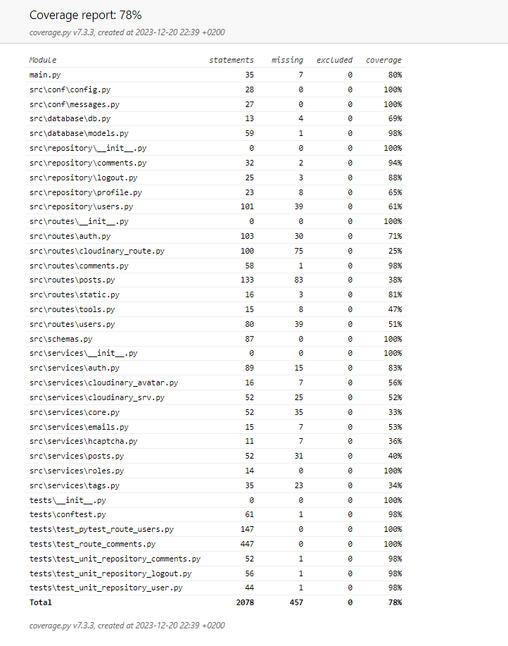


## Бонусне завдання
### Простий JavaScript client (Front-end)

### Signup with hCaptha service.


### Change username on user profile

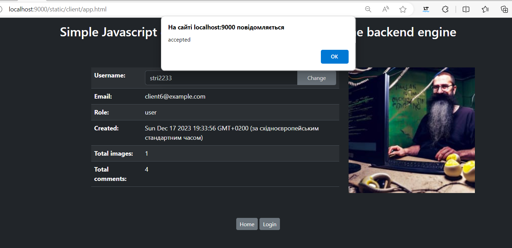

### Change avatar on user profile

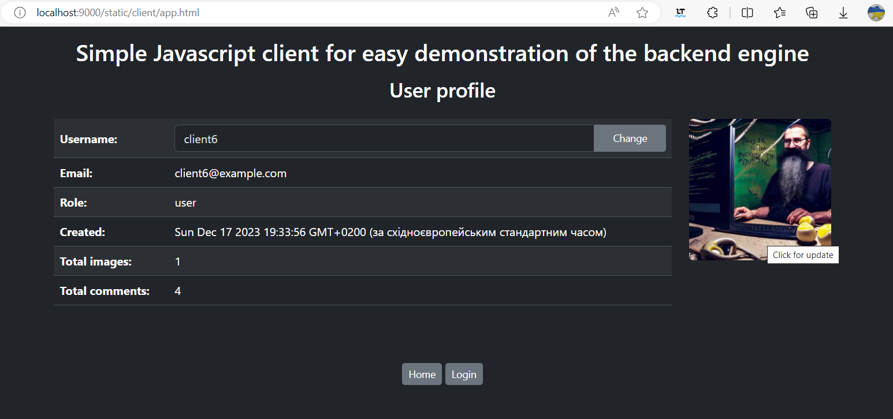
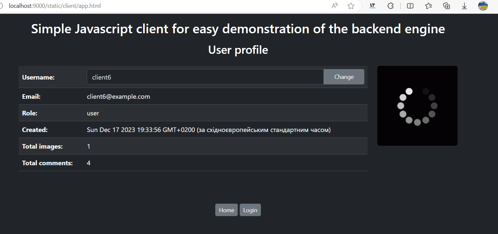
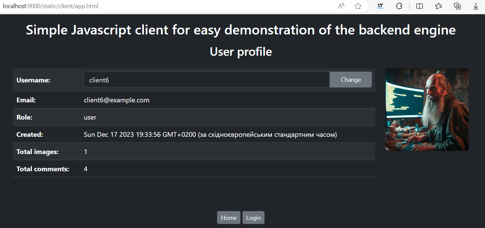

## Презентація
Youtube: https://youtu.be/WCTrSa8wCJQ